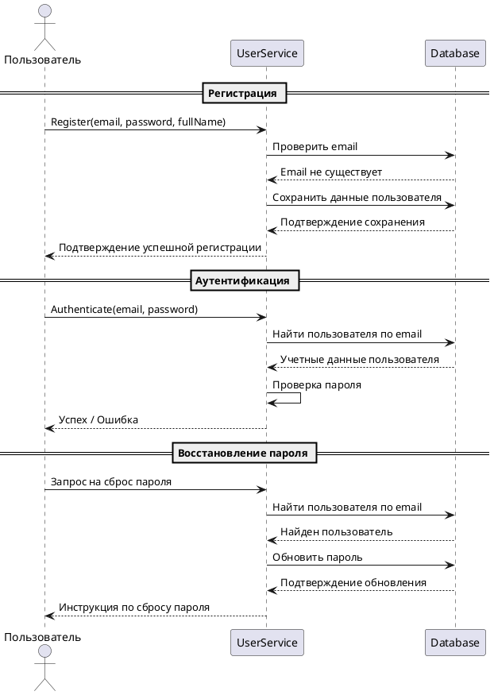

# 1. Регистрация пользователя
- **Название прецедента**: Регистрация пользователя
# Процедура регистрации:

1. **Пользователь вводит свои данные:**
    - Имя (обязательно)
    - Фамилия (опционально или обязательно, в зависимости от требований)
    - Электронная почта (обязательно, используется для идентификации и восстановления доступа)
    - Пароль (обязательно, с проверкой сложности)

2. **Система проверяет введенные данные на валидность:**
    - Электронная почта проверяется на корректность формата.
    - Пароль проверяется на соответствие требованиям безопасности.

3. **В случае успешной валидации:**
    - Создается новая запись пользователя в базе данных.
    - Отправляется подтверждение на указанный email (опционально, в зависимости от политики безопасности).

4. **Пользователь завершает регистрацию, подтвердив свою почту (если требуется).**

---

# Процедура аутентификации:

1. **Пользователь вводит свои учетные данные:**
    - Электронная почта
    - Пароль

2. **Система проверяет:**
    - Наличие пользователя с указанной электронной почтой в базе данных.
    - Совпадение введенного пароля с хранимым (хешированным) значением.

3. **В случае успешной аутентификации:**
    - Пользователь получает доступ к системе.
    - Генерируется и сохраняется токен сессии (например, JWT) для последующего доступа.

4. **При ошибке аутентификации:**
    - Пользователю выводится соответствующее сообщение (например, «Неверный пароль» или «Пользователь не найден»).

5. **Дополнительно:**
    - Реализована функция восстановления пароля через email.
    - Возможна поддержка двухфакторной аутентификации (при необходимости).

---

# Особенности реализации:

1. **База данных:**
    - Хранение пользовательских данных (например, `users`), включая хешированные пароли и дополнительные поля, такие как фамилия.

2. **Технологии безопасности:**
    - Хеширование паролей (например, с использованием bcrypt).
    - Использование защищенного соединения (SSL/TLS).

3. **Дополнительные функции:**
    - Поддержка анонимной регистрации/аутентификации (опционально, как временная функция).
    - Логирование попыток входа для обеспечения безопасности.

---
*Код класса для C#

using System;
using System.ComponentModel.DataAnnotations;
using System.Security.Cryptography;
using System.Text;

namespace UserManagement
{
    public class User
    {
        [Key]
        public Guid Id { get; set; } = Guid.NewGuid();

        [Required, EmailAddress]
        public string Email { get; set; }

        [Required]
        public string PasswordHash { get; set; }

        public string FullName { get; set; }

        public DateTime CreatedAt { get; set; } = DateTime.UtcNow;

        public static string HashPassword(string password)
        {
            using (var sha256 = SHA256.Create())
            {
                var bytes = Encoding.UTF8.GetBytes(password);
                var hash = sha256.ComputeHash(bytes);
                return Convert.ToBase64String(hash);
            }
        }

        public bool VerifyPassword(string password)
        {
            return PasswordHash == HashPassword(password);
        }
    }

    public class UserService
    {
        private readonly List<User> _users = new();

        public bool Register(string email, string password, string fullName)
        {
            if (_users.Exists(u => u.Email == email))
            {
                throw new Exception("User with this email already exists.");
            }

            var user = new User
            {
                Email = email,
                PasswordHash = User.HashPassword(password),
                FullName = fullName
            };

            _users.Add(user);
            return true;
        }

        public User Authenticate(string email, string password)
        {
            var user = _users.Find(u => u.Email == email);

            if (user == null || !user.VerifyPassword(password))
            {
                throw new Exception("Invalid email or password.");
            }

            return user;
        }

        public bool ResetPassword(string email, string newPassword)
        {
            var user = _users.Find(u => u.Email == email);

            if (user == null)
            {
                throw new Exception("User not found.");
            }

            user.PasswordHash = User.HashPassword(newPassword);
            return true;
        }
    }
}
*Диаграмма класса

