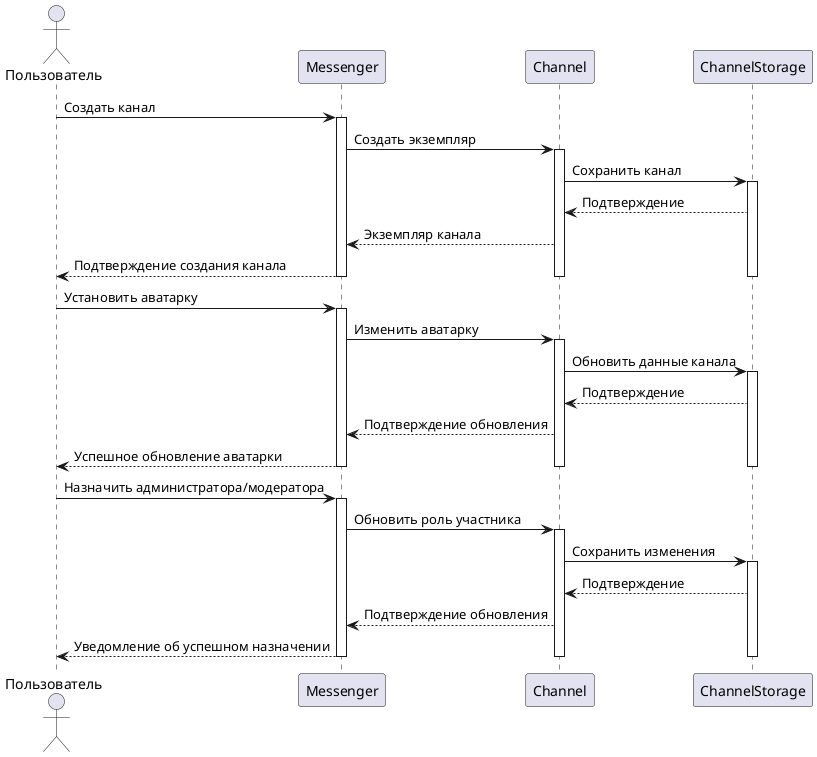

# Управление каналами

## Описание прецедента

**Действующие лица:**
- **Пользователь (Создатель канала):** Инициирует создание и управление каналом.
- **Администратор канала:** Установлен создателем канала; управляет настройками и участниками.
- **Модератор канала:** Назначается администратором или создателем; управляет содержанием канала.
- **Участник:** Подписан на канал и может просматривать публикации.

---

**Цель:**
Предоставить пользователям возможность создавать каналы для общения, информации или сообщества, с гибкими настройками управления и модерации.

---

## Процедуры:

**Создание канала с выбором параметров:**
1. **Пользователь** инициирует создание канала через интерфейс приложения.
2. Вводится основная информация: название канала, тип канала (публичный/приватный), категория (например, "Новости", "Образование").
3. Выбираются настройки: разрешения для участников (только просмотр/комментирование/публикация), возможность подписки по ссылке или только по приглашению, подтверждение настроек и создание канала.
4. Канал добавляется в список каналов **пользователя**.

---

**Установка аватарки канала:**
1. **Создатель** или **администратор** открывает настройки канала.
2. Выбирается опция "Изменить аватарку".
3. Загружается изображение с устройства или выбирается из галереи.
4. Устанавливаются параметры обрезки или оформления изображения (по желанию).
5. Аватарка сохраняется и отображается в канале.

---

**Назначение администраторов и модераторов:**
1. **Создатель** или **администратор** канала открывает список участников.
2. Выбирается участник для назначения роли.
3. Устанавливается роль:
- **Администратор:** имеет доступ к полному управлению каналом.
- **Модератор:** может управлять контентом и комментарием, но не имеет доступа к критическим настройкам.
- **Пользователь** получает уведомление о назначении роли.

*Роль может быть изменена или отозвана через тот же интерфейс.*

---

## Диаграмма последовательности

