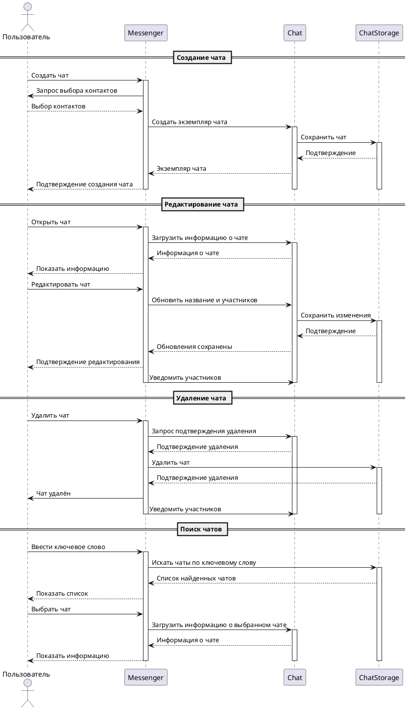

# Прецедент: Управление чатами в мессенджере

## Название
Управление чатами в мессенджере

## Участники
- Пользователь
- Система (Мессенджер)

## Предусловия
- Пользователь должен быть зарегистрирован и авторизован в системе.
- У пользователя должны быть контакты для создания чата.

## Основной сценарий

### 1. Создание чата
1. Пользователь выбирает опцию "Создать чат".
2. Система запрашивает выбор контактов.
3. Пользователь выбирает контакты из списка.
4. Система создает новый чат.
5. Система уведомляет пользователя о создании чата.

### 2. Редактирование чата
1. Пользователь открывает существующий чат.
2. Система отображает информацию о чате.
3. Пользователь выбирает опцию "Редактировать чат".
4. Система отображает опции редактирования.
5. Пользователь изменяет название и участников чата.
6. Пользователь подтверждает изменения.
7. Система обновляет информацию о чате.
8. Система уведомляет участников об изменениях.

### 3. Удаление чата
1. Пользователь открывает чат, который хочет удалить.
2. Система отображает информацию о чате.
3. Пользователь выбирает опцию "Удалить чат".
4. Система запрашивает подтверждение удаления.
5. Пользователь подтверждает удаление.
6. Система удаляет чат из списка.
7. Система уведомляет участников об удалении чата.

### 4. Поиск чатов
1. Пользователь вводит ключевое слово для поиска чатов.
2. Система ищет чаты по введенному ключевому слову.
3. Система отображает список найденных чатов.
4. Пользователь выбирает нужный чат из списка.

## Альтернативные сценарии
- Если пользователь не выбрал ни одного контакта при создании чата, система уведомляет его об этом и предлагает повторить выбор.
- Если пользователь отменяет редактирование, система возвращает его к предыдущему экрану без сохранения изменений.

## Постусловия
- Чат успешно создан, отредактирован или удален в системе в зависимости от выполненных действий пользователя.

# Диаграмма последовательности

