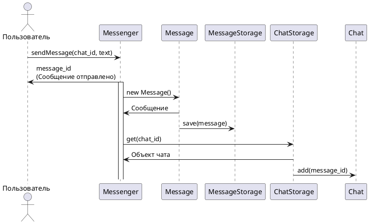

# Прецедент «Отправка сообщения»
**Уровень:** Задача, определённая пользователем

**Основной исполнитель**: Зарегистрированный пользователь (абонент)

**Заинтересованные лица и их требования**
- Отправитель: Хочет донести сообщения до одного или нескольких получателей
- Получатели: Хотят иметь возможность оперативно получать сообщения от отправителя

**Предусловия:** Получатель (получатели) и отправитель являются абонентами системы мгновенного обмена сообщениями (мессенджера). Если сообщение было отправлено в рамках группового чата/канала, то получатели обязаны являться его участниками.

## **Основной поток**:
```
1. Пользователь определяет контакт, групповой чат или канал, куда сообщение будет направлено.
2. Набирает текст сообщения в соответствующее поле ввода.
3. Нажимает кнопку отправки.
4. Система передает сообщение получателю (получателям).
5. Отправленное сообщение помечается как "Не прочитано".
6. Получатель получает уведомление о новом сообщении (текстовое и/или звуковое).
7. Если приложение получателя активно, сообщение отображается в списке чатов с отметкой "Новое".
8. Если приложение получателя не активно, уведомление передается в системную панель уведомлений устройства.
9. Получатель открывает приложение и просматривает сообщение.
10. После просмотра сообщение автоматически помечается как "Прочитано" в системе.
11. Если сообщение включает дополнительные файлы, получатель может их загрузить или открыть по предоставленной ссылке.
12. В случае проблем с загрузкой файлов получатель видит соответствующее уведомление.
```
## **Альтернативные потоки**

**А. Отправитель личного сообщения был заблокирован получателем (добавлен в чёрный список)**
```
1. Абонент получает уведомление о том, что ограничен в отправке текущему адресату
2. Поле для ввода последующих сообщений перестаёт быть доступным
```
    
**Б. Отправитель был заблокирован в групповом чате / канале**
```
1. Процесс ввода сообщения абонентом автоматически прерывается
2. Окно группового чата / канала перестаёт отображаться абоненту
3. Групповой чат / канал пропадает из списка доступных диалогов
```

**В. У отправителя прервалось подключение к сети "Интернет"**
```
1. Сообщение будет сохранено в локальную очередь
2. Отправленное сообщение будет помечено маркером "Ошибка отправки"
3. Раз в N секунд будет автоматически осуществляться повторная попытка отправки сообщения
4. Как только подключение будет восстановлено, сообщения из локальной очереди будут автоматически отправлены
```

**Г. Получатель личного сообщения не имеет доступа к сети "Интернет"**
```
1. Сообщение будет сохранено в очереди, у отправителя оно будет помечено как "Ожидает доставки".
2. Как только получатель будет вновь подключен к сети "Интернет", сообщения из очереди будут доставлены получателю.
```

**Д. Отправитель прикрепляет доп. контент к сообщению**

**Д1. Отправитель загружает новый файл**
```
1. Пользователь открывает меню "Добавить файлы"
2. Пользователь определяет, какие файлы хочет прикрепить к сообщению, после чего нажимает кнопку "Готово".
3. Пользователь отправляет сообщение.
4. Сообщение доставляется согласно основному сценарию.
5. Файлы отделяются от сообщения и проходят валидацию (объём и т.п.)
6. Файлы сохраняются на сервере и копии соответствующих экземпляров прикрепляеются к уже отправленному сообщению.
7. Ссылки на файлы, хранящиеся на сервере, также дублируются у отправителя в разделе "Сохранённые файлы" для возможности их дублирования без повторной загрузки
```

**Д2. Отправитель прикрепляет файл из раздела "Сохранённые файлы"**
```
1. Пользователь открывает меню "Добавить файлы", выбирает раздел "Сохранённые файлы"
2. Выбирает необходимые документ, нажимает кнопку "Готово"
3. Сообщение доставляется согласно основному сценарию.
4. Копии соответствующих экземпляров мгновенно прикрепляются к уже отправленному сообщению
```


# Диаграмма последовательности



