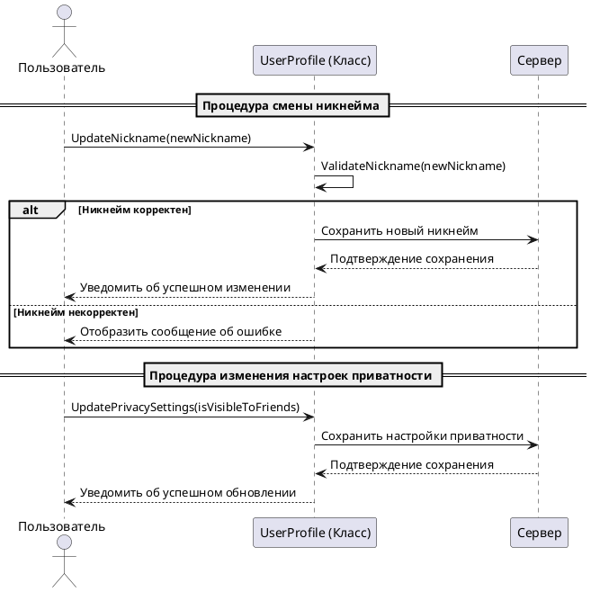

# Управление профилем и настройками

## Описание прецедента  

**Действующие лица:**  
- **Пользователь**: Человек, использующий мессенджер для общения и управления своими данными.  
- **Система**: Программное обеспечение мессенджера, обеспечивающее выполнение операций по запросу пользователя.  

---

**Цель:**  
Пользователь должен иметь возможность настраивать свой профиль и управлять параметрами приватности для повышения удобства и безопасности использования мессенджера.  

---

### Процедура смены никнейма  

1. **Пользователь** открывает приложение и переходит в раздел настроек профиля.  
2. **Система** отображает текущую информацию профиля, включая никнейм.  
3. **Пользователь** нажимает на поле с никнеймом и вводит новый никнейм.  
4. **Система** проверяет введённый никнейм на соответствие правилам (например, допустимая длина, отсутствие запрещённых символов).  
   - Если никнейм соответствует правилам, **Система** сохраняет изменения.  
   - Если никнейм не соответствует правилам, **Система** отображает сообщение об ошибке и предлагает ввести другой никнейм.  
5. **Система** уведомляет пользователя об успешном изменении никнейма.  

---

### Процедура изменения настроек приватности  

1. **Пользователь** открывает приложение и переходит в раздел настроек приватности.  
2. **Система** отображает текущие параметры приватности (например, кто может видеть профиль, статус "онлайн", отправлять сообщения).  
3. **Пользователь** изменяет параметры, например, выбирает, что статус "онлайн" виден только друзьям.  
4. **Система** проверяет корректность данных и сохраняет изменения.  
5. **Система** уведомляет пользователя о том, что настройки приватности успешно обновлены.  

---

### Особенности реализации  

1. **Обновление данных:**  
   - При изменении никнейма информация обновляется на сервере в профиле пользователя и в клиенте приложения.  
   - Данные о приватности также синхронизируются с сервером, чтобы сохранить их актуальность для всех взаимодействий.  

2. **Валидация данных:**  
   - Правила валидации (например, ограничения на длину и символы никнейма) хранятся на стороне сервера и клиента для обеспечения согласованности.  

3. **Обратная связь:**  
   - В случае успешного изменения данных отображается уведомление.  
   - В случае ошибок система предоставляет пояснения и рекомендации для исправления.  

4. **Реализация интерфейса:**  
   - Интерфейс настроек содержит интуитивно понятные элементы (например, переключатели, текстовые поля).  

---

## Код

```csharp
using System;

namespace MessengerApp
{
    public class UserProfile
    {
        public string Nickname { get; private set; }
        public bool IsOnlineVisibleToFriends { get; private set; }

        public UserProfile(string nickname)
        {
            Nickname = nickname;
            IsOnlineVisibleToFriends = true; // По умолчанию статус "онлайн" виден друзьям
        }

        public bool UpdateNickname(string newNickname)
        {
            if (ValidateNickname(newNickname))
            {
                Nickname = newNickname;
                Console.WriteLine("Никнейм успешно обновлен.");
                return true;
            }
            else
            {
                Console.WriteLine("Ошибка: недопустимый никнейм.");
                return false;
            }
        }

        public void UpdatePrivacySettings(bool isVisibleToFriends)
        {
            IsOnlineVisibleToFriends = isVisibleToFriends;
            Console.WriteLine("Настройки приватности успешно обновлены.");
        }

        private bool ValidateNickname(string nickname)
        {
            return !string.IsNullOrWhiteSpace(nickname) && nickname.Length >= 3 && nickname.Length <= 20;
        }
    }

   class Program
    {
        static void Main(string[] args)
        {
            UserProfile user = new UserProfile("User123");

            Console.WriteLine("Текущий никнейм: " + user.Nickname);
            Console.WriteLine("Изменение никнейма...");
            user.UpdateNickname("NewNickname");

            Console.WriteLine("Обновление настроек приватности...");
            user.UpdatePrivacySettings(false);

            Console.WriteLine("Текущий никнейм: " + user.Nickname);
            Console.WriteLine("Видимость статуса 'онлайн': " + (user.IsOnlineVisibleToFriends ? "Друзья" : "Никто"));
        }
    }
}
---
```

##Диаграмма класса



