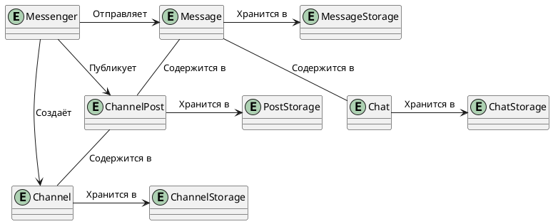

```plantuml
@startuml

entity Messenger
entity Message
entity Chat
entity Channel
entity ChannelPost

entity MessageStorage
entity PostStorage
entity ChatStorage
entity ChannelStorage

Message -down- Chat : Содержится в
Message -down- ChannelPost : Содержится в
ChannelPost -down- Channel : Содержится в

Message -> MessageStorage : Хранится в
Chat -> ChatStorage: Хранится в
Channel -> ChannelStorage: Хранится в
ChannelPost -> PostStorage: Хранится в

Messenger -> Message : Отправляет
Messenger -> ChannelPost: Публикует
Messenger -> Channel: Создаёт

@enduml
```
