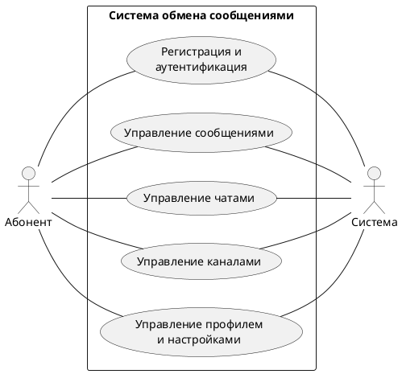

```plantuml
@startuml
skinparam packageStyle rect
left to right direction

:Абонент:

package "Система обмена сообщениями" {
  (Регистрация и\nаутентификация)
  (Управление сообщениями)
  (Управление чатами)
  (Управление каналами)
  (Управление профилем\nи настройками)
}

:Абонент: -- (Регистрация и\nаутентификация)
:Абонент: -- (Управление сообщениями)
:Абонент: -- (Управление чатами)
:Абонент: -- (Управление каналами)
:Абонент: -- (Управление профилем\nи настройками)

:Система:

(Регистрация и\nаутентификация) -- :Система:
(Управление сообщениями) -- :Система:
(Управление чатами) -- :Система:
(Управление каналами) -- :Система:
(Управление профилем\nи настройками) -- :Система:

@enduml
```
