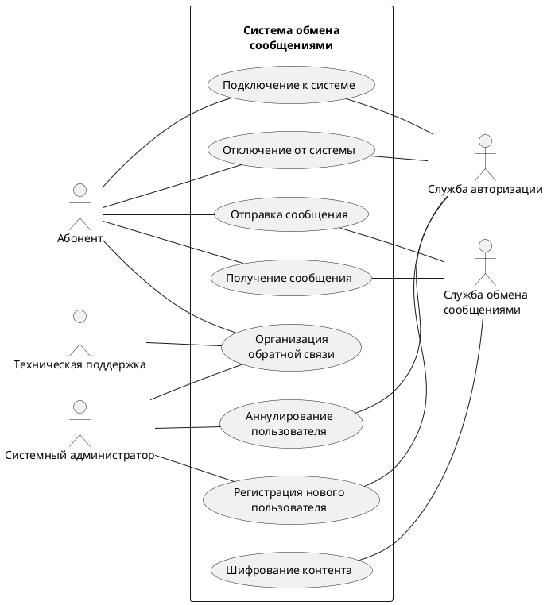

```plantuml
@startuml
skinparam packageStyle rect
left to right direction

:Абонент:
:Системный администратор:
:Техническая поддержка:

package "\nСистема обмена\nсообщениями" {

(Регистрация нового\nпользователя)
(Аннулирование\nпользователя)
(Подключение к системе)
(Отключение от системы)
(Отправка сообщения)
(Получение сообщения)
(Шифрование контента)
(Организация\nобратной связи)

}


:Абонент: -- (Подключение к системе)
:Абонент: -- (Отключение от системы)
:Абонент: -- (Отправка сообщения)
:Абонент: -- (Получение сообщения)
:Абонент: -- (Организация\nобратной связи)

:Системный администратор: -- (Регистрация нового\nпользователя)
:Системный администратор: -- (Аннулирование\nпользователя)
:Системный администратор: -- (Организация\nобратной связи)

:Техническая поддержка: -- (Организация\nобратной связи)

:Служба авторизации:
:Служба обмена\nсообщениями:


(Отправка сообщения) -- :Служба обмена\nсообщениями:
(Получение сообщения) -- :Служба обмена\nсообщениями:
(Шифрование контента) -- :Служба обмена\nсообщениями:
(Подключение к системе) -- :Служба авторизации:
(Отключение от системы) -- :Служба авторизации:
(Регистрация нового\nпользователя) -- :Служба авторизации:
(Аннулирование\nпользователя) -- :Служба авторизации:
@enduml
```
